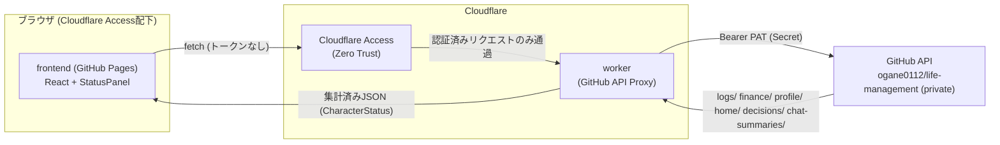
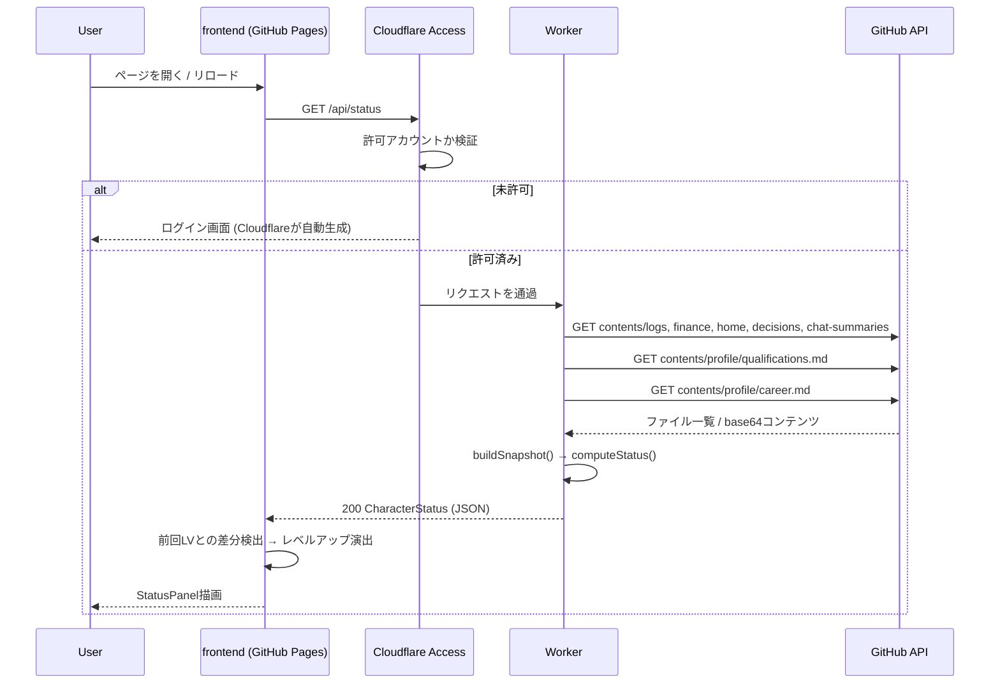

# アーキテクチャ設計

## 全体構成

要件定義書のアーキテクチャ図に対応する、実装済みのモノレポ構成は以下の3パッケージからなる。

```
packages/
  stats-engine/   ... リポジトリスナップショット → RPGステータスへの純粋な計算ロジック
  worker/         ... Cloudflare Worker（GitHub APIプロキシ + 集計API）
  frontend/        ... React + Storybook フロントエンド（GitHub Pages配信）
```



## なぜこの3分割か

`stats-engine` を `worker` から独立させたのは、GitHub APIのレスポンス形状（Contents API固有の
base64エンコーディングやページネーション）と、ステータス計算のドメインロジック（重み付け・
飽和関数・XPカーブ）を分離するため。これにより:

- 計算式の妥当性を、実際のGitHub API呼び出しなしに大量のユニットテストで検証できる
- 将来 `stats-engine` をフロントエンド側（モックデータでのプレビュー、Storybookでのステータス
  パネル表示など）からも再利用できる

詳細な判断根拠は [decisions/0001-monorepo-structure.md](../decisions/0001-monorepo-structure.md) を参照。

## リクエストフロー（1回のページ表示）



## リアルタイム性・private対応（要件との対応）

| 要件 | 実装 |
|---|---|
| フロントはWorkerを叩くたびに最新状態を取得 | Workerはレスポンスをキャッシュせず、毎リクエストGitHub APIを再取得する（`packages/worker/src/index.ts`） |
| トークンはフロントに一切渡さない | `GITHUB_TOKEN` はWorkerの環境変数（Secret）としてのみ保持し、`GitHubClient` 内部でのみ使用（`packages/worker/src/github.ts`） |
| private repoアクセス | Worker→GitHub API は `Authorization: Bearer <PAT>` で認証（PATにcontents:readのfine-grained権限が必要） |
| Cloudflare Access | Worker/Pagesの手前に配置する運用上の設定。コードでの認可チェックは行わず、Cloudflare側の設定に委譲（[decisions/0003](../decisions/0003-cloudflare-worker-proxy-design.md) 参照） |

## このセッションで実装していない範囲

以下は実インフラ（Cloudflareアカウント、GitHub PAT、実際の `life-management` リポジトリの
中身）へのアクセスが必要なため、コード・設定・ドキュメントとしては用意したが、実際の
デプロイ・疎通確認は未実施。詳細手順は [deployment.md](../deployment.md) を参照。

- `wrangler secret put GITHUB_TOKEN` によるトークン投入
- Cloudflare Pages/Workersへの実デプロイ
- Cloudflare Access の許可リスト設定
- 実際の `life-management` リポジトリのファイル形式が本実装の想定（後述の
  [status-calculation.md](./status-calculation.md) のデータ契約）と一致するかの確認
