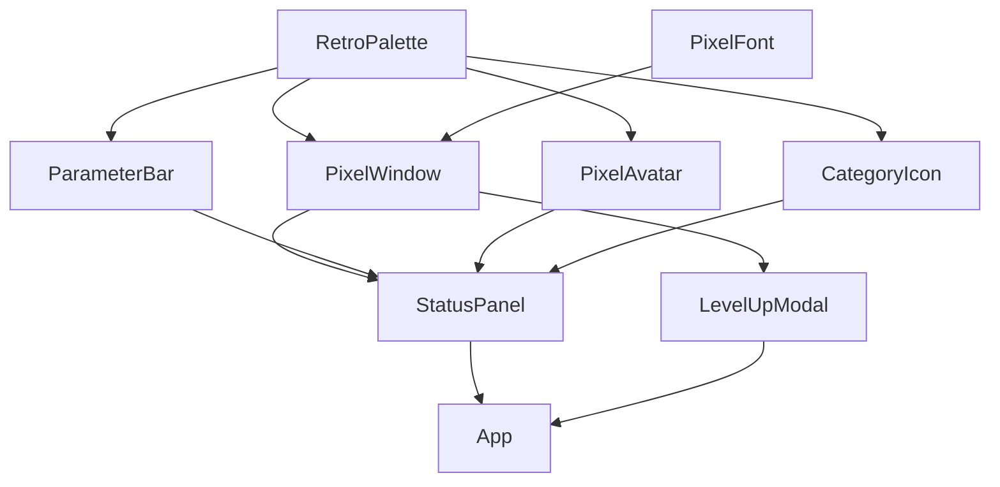

# コンポーネント設計（Storybookカタログ）

`packages/frontend/src/components/` に実装、各コンポーネントは `.stories.tsx` を持ち
`npm run build-storybook --workspace=@ganesya/frontend` でカタログをビルド確認済み。

| コンポーネント | 役割 | 主なProps | 対応するテスト |
|---|---|---|---|
| `PixelWindow` | ドラクエ風の枠線テキストウィンドウ。他の全パネルの土台 | `title?`, `children` | `PixelWindow.test.tsx` |
| `ParameterBar` | HP/MPゲージ風バー。値変化時にパラパラカウントアップ | `label`, `value`, `max`, `colorVar?` | `ParameterBar.test.tsx` |
| `StatusPanel` | LV＋全ステータスバーをまとめたキャラクターカード | `status: CharacterStatus`, `characterName?` | `StatusPanel.test.tsx` |
| `PixelAvatar` | レベル帯（novice/adept/veteran/legend）で見た目が変わるアバター | `level` | `PixelAvatar.test.tsx` |
| `LevelUpModal` | 「レベルが あがった！」演出モーダル（フラッシュ＋ビープ音＋カウントアップ） | `previousLevel`, `newLevel`, `onClose`, `playSound?`, `playBeep?` | `LevelUpModal.test.tsx` |
| `CategoryIcon` | 各カテゴリ（HP/INT/財力/装備/判断力/絆）のドット風アイコン | `category` | `CategoryIcon.test.tsx` |
| `PixelFont`（トークン） | `--pixel-font` CSS変数。"Press Start 2P" + 和文フォールバック | — | `global.css` |
| `RetroPalette`（トークン） | NES風の限定色パレット。`RetroPalette` オブジェクト＋`--rp-*` CSS変数 | — | `tokens/palette.ts` |

## 依存関係

## 演出（レベルアップ）の実装

要件定義の3要素すべてを実装している：

1. **画面フラッシュ＋テキストボックス** — `LevelUpModal` の `.headline` に
   `@keyframes flash` によるopacity点滅アニメーションを適用（`LevelUpModal.module.css`）。
2. **ピコピコ音** — `packages/frontend/src/audio/beep.ts` の `playBeepSequence` が
   Web Audio API（`OscillatorNode` の square波）で上昇アルペジオを合成。
   AudioContext非対応環境やユーザー操作前のautoplay制限で失敗しても、演出自体は
   落ちないよう例外を握りつぶす設計にしている。
3. **数値のパラパラカウントアップ** — `useCountUp` フック（`hooks/useCountUp.ts`）が
   `requestAnimationFrame` で表示値を前回値→新値へ補間する。`ParameterBar` と
   `LevelUpModal` の両方で共用。

レベルアップの検知自体は `useLevelUpDetection` フック（`hooks/useLevelUpDetection.ts`）が
担当し、`localStorage` に前回表示したLVを保存することで「リポジトリ更新後にリロードしたら
レベルアップ演出が出る」という要件のリアルタイム性を、ページ単体の状態だけで実現している
（サーバー側にセッション状態を持たない）。

## デザイントークンの選定理由

`RetroPalette` は NES 風に色数を絞った十数色のみを定義し、コンポーネント側は必ず
`var(--rp-*)` 経由で色を参照する（コンポーネントファイル内にハードコードされた16進色を
置かない）。理由と代替案の比較は
[decisions/0004-retro-design-tokens.md](../decisions/0004-retro-design-tokens.md) を参照。

## 既知の制約（プレースホルダー実装）

`PixelAvatar` は、実際のドット絵スプライトシートの代わりにCSS単色ブロックで
代替している（本物のピクセルアートアセットは今回未作成）。差し替え可能な設計に
してあるので、アセットが用意でき次第 `PixelAvatar.module.css` の背景色指定を
画像/SVGスプライトに置き換えるだけで移行できる。判断根拠は
[decisions/0005-placeholder-pixel-art.md](../decisions/0005-placeholder-pixel-art.md)。

`CategoryIcon` は当初Unicodeグリフで代替していたが、フォントによってはグリフが
表示されない実機不具合が見つかったため、8x8のインラインSVGドット絵
（`pixelGrids.ts`）に置き換え済み（[decisions/0008](../decisions/0008-svg-pixel-icons-and-layout-polish.md)）。
フォント非依存で確実に描画される、抽象度の高いシルエットアイコン。
